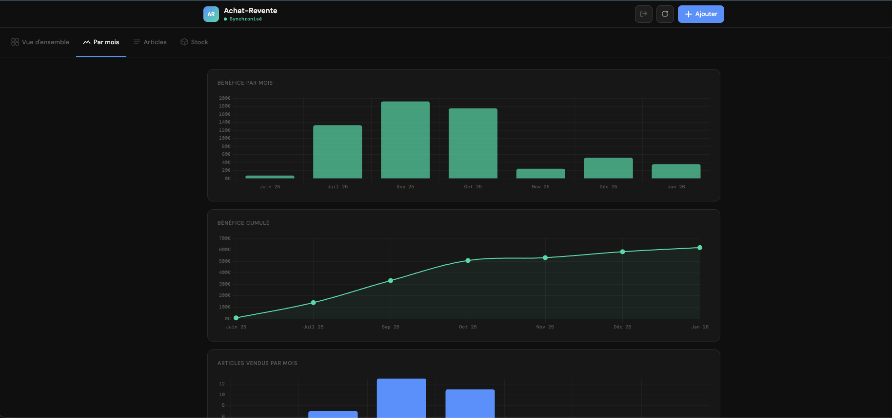
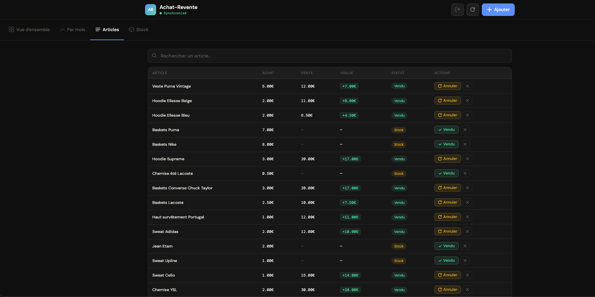

# 📦 Achat-Revente

> Application web progressive (PWA) de suivi d'achat-revente — vêtements, électronique, jeux vidéo, jouets, décoration et plus encore. Synchronisée en temps réel sur tous vos appareils.

   

---

## 📸 Aperçu


<p align="center">
  <a href="screenshot-mois.png"></a>&nbsp;&nbsp;
  <a href="screenshot-articles.png"></a>&nbsp;&nbsp;
  <a href="screenshot-login.png"></a>
</p>

---

## ✨ Fonctionnalités

- 📊 **Tableau de bord** avec statistiques en temps réel (bénéfice, ROI, recettes)
- 📈 **Graphiques avec valeurs affichées** — flux mensuel, bénéfice cumulé, catégories vendues, top plus-values
- 🎯 **Objectif mensuel** — jauge de progression des recettes, modifiable depuis l'app
- 📋 **Gestion des articles** — ajout, modification, vente, annulation de vente, suppression
- 🏷️ **Catégories** — 12 types d'articles au choix (vêtements, électronique, jeux vidéo, consoles, jouets, décoration, outils…)
- ✏️ **Modification complète** — cliquez sur le nom d'un article pour modifier son nom, catégorie, prix et dates
- 📦 **Suivi du stock** — capital immobilisé, taux de rotation, prix par article affiché, défilement complet
- 🔄 **Synchronisation temps réel** — toutes vos modifications apparaissent instantanément sur tous vos appareils
- 🔒 **Authentification sécurisée** — email + mot de passe via Supabase Auth, base de données verrouillée par RLS
- 📱 **PWA installable** — fonctionne comme une vraie app sur iPhone, Android, Mac et PC
- 🌙 **Design sombre** — interface soignée optimisée mobile et desktop

---

## 🛠️ Stack technique

| Composant | Technologie | Rôle |
|-----------|-------------|------|
| **Frontend** | HTML / CSS / JavaScript vanilla | Interface utilisateur |
| **Base de données** | [Supabase](https://supabase.com) (PostgreSQL) | Stockage et synchronisation des données |
| **Auth** | Supabase Auth | Authentification sécurisée |
| **Hébergement** | [Vercel](https://vercel.com) | Déploiement automatique |
| **Graphiques** | [Chart.js](https://chartjs.org) + chartjs-plugin-datalabels | Visualisation des données avec valeurs |
| **Polices** | DM Sans + DM Mono (Google Fonts) | Typographie |

---

## 🚀 Déployer votre propre instance

### Prérequis

- Un compte [GitHub](https://github.com) (gratuit)
- Un compte [Supabase](https://supabase.com) (gratuit)
- Un compte [Vercel](https://vercel.com) (gratuit)

---

### Étape 1 — Télécharger les fichiers du projet

1. Sur cette page GitHub, cliquez sur **Code** (bouton vert en haut à droite)
2. Cliquez **Download ZIP**
3. Extrayez le ZIP sur votre ordinateur
4. Vous obtenez un dossier avec tous les fichiers du projet

---

### Étape 2 — Créer le projet Supabase

1. Allez sur [supabase.com](https://supabase.com) → **Start your project**
2. Connectez-vous avec GitHub ou Google
3. Créez un nouveau projet :
   - **Nom** : `achat-revente`
   - **Région** : `West EU (Ireland)` (ou la plus proche de vous)
   - **Mot de passe** : générez-en un fort (vous n'en aurez pas besoin)
4. Attendez que le projet soit prêt (~1 minute)

---

### Étape 3 — Créer la table articles

Dans Supabase → **SQL Editor** → collez ce code et cliquez **Run** :

```sql
-- Création de la table
CREATE TABLE articles (
  id bigserial PRIMARY KEY,
  nom text NOT NULL,
  prix_achat numeric NOT NULL,
  date_achat date NOT NULL,
  prix_revente numeric,
  date_revente date,
  categorie text,
  created_at timestamptz DEFAULT now()
);

-- Activation de la sécurité RLS
ALTER TABLE articles ENABLE ROW LEVEL SECURITY;

-- Politiques : accès uniquement aux utilisateurs authentifiés
CREATE POLICY "Auth lecture"      ON articles FOR SELECT TO authenticated USING (true);
CREATE POLICY "Auth insertion"    ON articles FOR INSERT TO authenticated WITH CHECK (true);
CREATE POLICY "Auth modification" ON articles FOR UPDATE TO authenticated USING (true);
CREATE POLICY "Auth suppression"  ON articles FOR DELETE TO authenticated USING (true);
```

---

### Étape 4 — Exposer la table dans l'API

1. Dans Supabase → **Integrations** → **Data API** → onglet **Settings**
2. Dans **"Exposed tables"** → sélectionnez `articles`
3. Cliquez **Save**

---

### Étape 5 — Récupérer les clés Supabase

Dans Supabase → **Settings** → **API Keys** :

- **Project URL** : `https://xxxxxxxxxxxx.supabase.co`
- **Anon / Public key** : `eyJhbGci...` *(clé longue commençant par eyJ)*

Notez ces deux valeurs, vous en aurez besoin à l'étape suivante.

---

### Étape 6 — Configurer le code

Ouvrez le fichier `app.js` (dans le dossier téléchargé à l'étape 1) et modifiez les deux premières lignes :

```javascript
const SUPABASE_URL = 'https://VOTRE-URL.supabase.co';   // ← votre Project URL
const SUPABASE_KEY = 'VOTRE_CLE_ANON';                  // ← votre Anon key
```

Sauvegardez le fichier.

---

### Étape 7 — Déployer sur GitHub

1. Allez sur [github.com](https://github.com) → **New repository**
2. Nom : `achat-revente` → **Public** → **Create**
3. Uploadez tous les fichiers du projet via **"Add file → Upload files"** :
   - `index.html`
   - `style.css`
   - `app.js` *(celui que vous venez de modifier)*
   - `manifest.json`
   - `vercel.json`
   - `favicon.svg`
4. Cliquez **Commit changes**

---

### Étape 8 — Déployer sur Vercel

1. Allez sur [vercel.com](https://vercel.com) → connectez-vous avec GitHub
2. **Add New Project** → sélectionnez votre repo `achat-revente`
3. Cliquez **Deploy** (aucune configuration nécessaire)
4. Vercel vous donne une URL : `achat-revente-XXXX.vercel.app` 🎉 — **notez-la**

---

### Étape 9 — Configurer l'URL dans Supabase Auth

> ⚠️ Cette étape est importante — sans elle, les emails d'invitation pointent vers `localhost:3000` et ne fonctionnent pas.

1. Dans Supabase → **Authentication** → **URL Configuration**
   - **Site URL** : `https://VOTRE-APP.vercel.app` *(l'URL obtenue à l'étape 8)*
   - **Redirect URLs** : `https://VOTRE-APP.vercel.app`
   - Cliquez **Save**

---

### Étape 10 — Créer votre compte utilisateur

1. Dans Supabase → **Authentication** → **Users** → cliquez **"Add user"**
2. Renseignez votre **email** et un **mot de passe**
3. Cliquez **"Create user"**

> Le mot de passe est hashé en **bcrypt** par Supabase — il ne sera jamais stocké en clair.

---

### Étape 11 — Installer sur téléphone (optionnel)

**Sur iPhone/iPad (Safari uniquement) :**
1. Ouvrez votre URL dans Safari
2. Appuyez sur l'icône **Partager** (carré avec flèche)
3. **"Sur l'écran d'accueil"** → **Ajouter**

**Sur Android (Chrome) :**
1. Ouvrez votre URL dans Chrome
2. Menu ⋮ → **"Ajouter à l'écran d'accueil"**

---

## 📁 Structure du projet

```
achat-revente/
├── index.html        # Structure HTML + modales
├── style.css         # Styles (thème sombre, responsive)
├── app.js            # Logique applicative + connexion Supabase
├── manifest.json     # Configuration PWA
├── vercel.json       # Configuration déploiement Vercel
├── favicon.svg       # Logo AR (onglet navigateur)
└── README.md         # Ce fichier
```

---

## 🔒 Sécurité

- **Authentification** : Supabase Auth (email + mot de passe, tokens JWT)
- **Base de données** : Row Level Security (RLS) — aucune donnée accessible sans authentification
- **Mot de passe** : hashé en bcrypt dans Supabase, jamais stocké en clair
- **Code source** : aucune donnée sensible — seule la clé `anon` publique est présente (elle est conçue pour être exposée)

---

## 🏗️ Architecture

```
┌─────────────┐     déploiement auto     ┌─────────────┐
│   GitHub    │ ─────────────────────▶   │   Vercel    │
│  (code)     │                          │ (hébergeur) │
└─────────────┘                          └──────┬──────┘
                                                │ interface
                                                ▼
                                         ┌─────────────┐
                                         │    Vous     │
                                         │ (navigateur)│
                                         └──────┬──────┘
                                                │ données
                                                ▼
                                         ┌─────────────┐
                                         │  Supabase   │
                                         │ (PostgreSQL)│
                                         └─────────────┘
```

- **GitHub** = coffre-fort du code (historique, versioning)
- **Vercel** = publie l'app sur Internet, redéploie automatiquement à chaque modification GitHub
- **Supabase** = base de données cloud, synchronisation temps réel entre tous vos appareils

---

## 📊 Importer des données existantes

Si vous avez déjà des articles à importer, créez un fichier SQL avec ce format et collez-le dans le **SQL Editor** de Supabase :

```sql
INSERT INTO articles (nom, prix_achat, date_achat, prix_revente, date_revente, categorie) VALUES
('Veste Adidas', 5, '2025-06-01', 18, '2025-09-10', 'Vêtements'),
('Jean Levi''s 501', 3, '2025-06-15', NULL, NULL, 'Vêtements'),
('PS5', 200, '2025-07-01', 350, '2025-08-20', 'Consoles'),
('Perceuse Bosch', 15, '2025-08-01', NULL, NULL, 'Outils');
```

> Les catégories disponibles sont : `Vêtements`, `Chaussures`, `Jeux vidéo`, `Consoles`, `Électronique`, `Jouets`, `Décoration`, `Ustensiles`, `Outils`, `Livres`, `Sport`, `Autres`

---

## ❓ Problèmes fréquents

| Problème | Solution |
|----------|----------|
| L'app affiche "Hors ligne" | Vérifiez vos clés Supabase dans `app.js` et que la table `articles` est bien exposée dans Data API → Settings |
| Le lien d'invitation pointe vers `localhost:3000` | Configurez l'URL Vercel dans Supabase → Authentication → URL Configuration **avant** d'envoyer l'invitation |
| Les données ne s'affichent pas | Vérifiez que les politiques RLS ont bien été créées via le SQL Editor |
| Erreur 401 / accès refusé | Reconnectez-vous — la session a peut-être expiré |
| L'app reste bloquée sur l'écran AR | Vérifiez la console du navigateur (F12) — souvent une erreur de syntaxe dans `app.js` ou des clés Supabase incorrectes |
| Les graphiques ne s'affichent pas | Vérifiez que le script `chartjs-plugin-datalabels` est bien chargé dans `index.html` avant `app.js` |
| L'objectif mensuel se remet à zéro | L'objectif est sauvegardé en local (localStorage) — il est propre à chaque appareil/navigateur |

---

## 📝 Changelog

### v1.2 — Mai 2026
- 🎯 Jauge d'objectif mensuel (recettes) modifiable depuis l'app
- 📊 Valeurs affichées directement sur tous les graphiques (sans survol)
- 📦 Stock : affichage de tous les articles avec prix à droite, défilement complet
- ✏️ Modification d'un article en cliquant sur son nom dans le tableau
- 🏷️ 12 catégories de produits sélectionnables à l'ajout et à la modification
- 🔒 Authentification Supabase Auth (email + mot de passe) avec RLS
- 🔑 Bouton de déconnexion dans le header
- 🔄 Bouton d'actualisation manuelle dans le header

### v1.1 — Avril 2026
- Catégories d'articles (12 types)
- Modification complète d'un article (nom, prix, dates, catégorie)
- Scroll horizontal sur le tableau Articles en mobile

### v1.0 — Avril 2026
- Lancement initial
- Tableau de bord, graphiques, gestion stock
- PWA installable, synchronisation temps réel Supabase

---

## 🤝 Contribution

Ce projet est open-source. N'hésitez pas à fork, améliorer et partager !

---

*Construit avec ❤️ et Claude AI*
