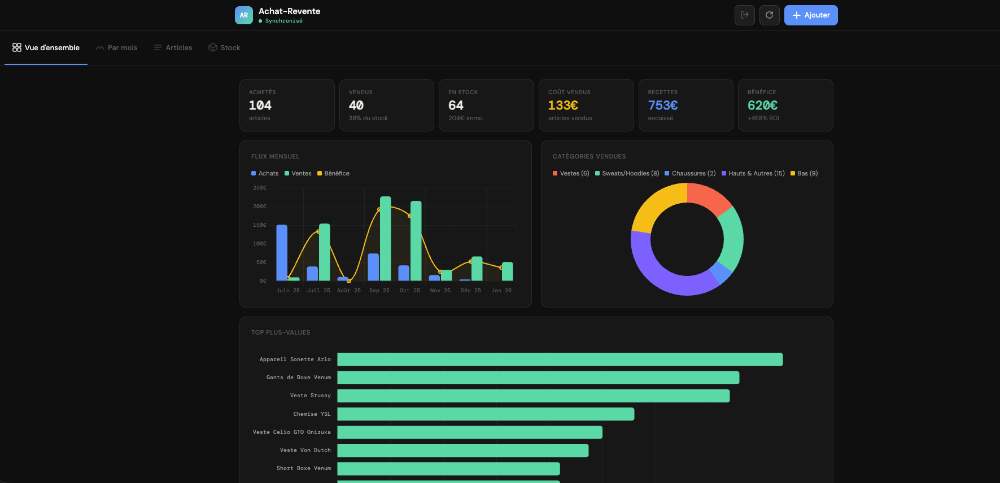
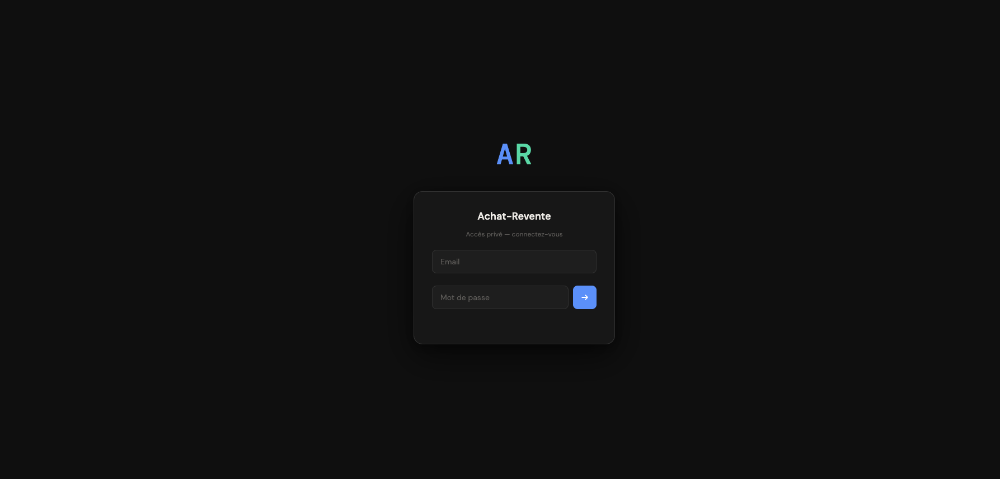

# 📦 Achat-Revente

> **Laney** — Application web progressive (PWA) de suivi d'achat-revente — vêtements, électronique, jeux vidéo, jouets, décoration et plus encore. Synchronisée en temps réel sur tous vos appareils.

   

---

## 📸 Aperçu



<p align="center">
  <a href="assets/screenshot-mois.png"></a>&nbsp;&nbsp;
  <a href="assets/screenshot-articles.png"></a>&nbsp;&nbsp;
  <a href="assets/screenshot-login.png"></a>
</p>

---

## ✨ Fonctionnalités

- 📊 **Tableau de bord** avec statistiques en temps réel (bénéfice, ROI, recettes)
- 📈 **Graphiques avec valeurs affichées** — flux mensuel, bénéfice cumulé, catégories vendues, top plus-values
- 🎯 **Objectif mensuel** — jauge de progression des recettes, synchronisée sur tous les appareils via Supabase. En mode All, l'objectif est la somme des objectifs de chaque boutique
- 📅 **Ventes & Encaissements de la semaine** — deux cartes latérales dans Vue d'ensemble : paiements reçus et ventes réalisées depuis lundi 0h, qui basculent automatiquement sur la nouvelle semaine
- 💰 **Vente et encaissement séparés** — "Vendu" enregistre prix + date de vente (argent pas encore reçu) ; le bouton bleu "Encaisser" enregistre ensuite la date de réception du paiement
- 📐 **Pourcentages de plus-value** — % affiché sous "Position globale" dans la vue globale, et colonne "% +Value" dans le tableau Articles
- 📋 **Gestion des articles** — ajout, modification, vente, encaissement, annulation de vente, suppression
- 🏷️ **Catégories** — 13 types d'articles au choix (vêtements, électronique, jeux vidéo, consoles, jouets, décoration, outils…)
- ✏️ **Modification complète** — cliquez sur le nom d'un article pour modifier son nom, catégorie, prix, dates, SKU, N° commande, grossiste et ID
- 🔖 **SKU & N° commande** — champs optionnels sur chaque article, affichés en orange sous le nom avec bouton copie en un clic
- 🆔 **ID lié au SKU** — un ID identifie un modèle de produit (son SKU). Tous les articles partageant le même SKU reçoivent automatiquement le même ID. Un ID ne peut pas être attribué à deux SKU différents. Générateur intégré (⚡ Générer) — code 6 caractères garanti sans collision. Saisie manuelle possible
- 🏭 **Grossiste** — champ optionnel pour noter la source d'achat (Aliexpress, Temu, Brocante…), visible en colonne dans Articles et dans Stock par SKU
- 🔢 **Ajout en quantité** — sélecteur `−/+` dans le formulaire d'ajout pour créer N exemplaires identiques en un clic (chaque exemplaire est une ligne indépendante, vendable séparément). Design pill avec chiffre contrasté
- ⬇️ **Accès rapide en bas de liste** — flèche à côté de la recherche dans Articles pour aller directement tout en bas du tableau
- 📦 **Suivi du stock** — capital immobilisé, taux de rotation, prix par article affiché, défilement complet
- 📊 **Stock par SKU** — regroupement automatique des articles en stock par SKU, avec grossiste, quantité, valeur unitaire et valeur totale. SKU en badge orange avec bouton copie. Défilement horizontal sur mobile, colonnes jamais tronquées
- 🔄 **Synchronisation temps réel** — toutes vos modifications apparaissent instantanément sur tous vos appareils
- 🔒 **Authentification sécurisée** — email + mot de passe via Supabase Auth, base de données verrouillée par RLS
- 👑 **Système admin** — panneau d'administration accessible depuis le header (icône bouclier). Permet de créer des comptes, définir des permissions par onglet, modifier les mots de passe et supprimer des comptes. Les comptes sans profil sont automatiquement déconnectés
- 📱 **PWA installable** — fonctionne comme une vraie app sur iPhone, Android, Mac et PC
- 🌙 **Design sombre** — interface soignée optimisée mobile et desktop, mise en page qui s'élargit sur grand écran pour exploiter l'espace disponible
- ⚡ **Mise à jour instantanée** — l'interface se rafraîchit automatiquement après chaque action sans rechargement
- 🔍 **Recherche étendue par mot-clé** — barre de recherche dans le header (desktop) et sous la nav (mobile) ; cherche dans le **nom**, le **SKU**, le **N° commande**, le **grossiste** et l'**ID**, mot par mot et dans n'importe quel ordre (ex : "short levi's" retrouve "Short en jean Levi's")
- 🏪 **Multi-boutiques** — plusieurs activités séparées (Brocante, Vinted, Leboncoin…), chacune avec ses propres articles, stats et bilans. Basculez d'une boutique à l'autre en un clic. Ordre personnalisable par glisser-déposer, synchronisé sur tous les appareils. Le bouton Ajouter est masqué en mode All
- 🔽 **Filtres Articles** — filtrer par statut (stock/vendu), par catégorie, par **grossiste** (liste dynamique) et trier par plus-value, prix, date ou nom
- 📅 **Bilan mensuel et annuel** — articles achetés et vendus listés séparément, stats complètes, top plus-values, camembert catégories
- 📤 **Export Excel** — bouton de téléchargement dans le header, génère un fichier avec 4 onglets : Articles (SKU, N° commande, grossiste, boutique, dates de vente **et d'encaissement**, statut En stock/Vendu/Encaissé), Résumé (dont recettes encaissées et montant en attente d'encaissement), Bilan mensuel (recettes vendues **et** encaissées par mois), Stock par SKU
- 📥 **Import SQL** — bouton dans le header (disponible par boutique), coller un INSERT SQL pour importer des articles en masse directement depuis l'app, `date_encaissement` incluse
- 🗓️ **Calendrier personnalisé** — sélecteur de date sur mesure (navigation mois par mois, aujourd'hui mis en valeur, sélection en un clic)
- 🧾 **Onglet URSSAF** — aide à la déclaration auto-entrepreneur : CA calculé automatiquement par mois sur les **recettes encaissées** (date d'encaissement, conforme au régime BIC — mois en cours + 2 mois précédents), cotisations estimées (12,3 % + 0,1 % CFP), marquage "Déclaré" sauvegardé dans Supabase. Toggle par boutique pour inclure ou exclure ses ventes
- 🎯 **Radar marques** — suivez vos marques niches, notez leur intérêt d'achat de 1 à 7 étoiles, visualisez vos trouvailles et bénéfices moyens par marque. Alerte automatique à l'ajout d'un article si la marque est dans le Radar

---

## 🛠️ Stack technique

| Composant | Technologie | Rôle |
|-----------|-------------|------|
| **Frontend** | HTML / CSS / JavaScript vanilla | Interface utilisateur |
| **Base de données** | [Supabase](https://supabase.com) (PostgreSQL) | Stockage et synchronisation des données |
| **Auth** | Supabase Auth | Authentification sécurisée |
| **Hébergement** | [Vercel](https://vercel.com) | Déploiement automatique |
| **Graphiques** | [Chart.js](https://chartjs.org) + chartjs-plugin-datalabels | Visualisation des données avec valeurs |
| **Polices** | DM Sans + DM Mono (Google Fonts) | Typographie |

---

## 🚀 Déployer votre propre instance

### Prérequis

- Un compte [GitHub](https://github.com) (gratuit)
- Un compte [Supabase](https://supabase.com) (gratuit)
- Un compte [Vercel](https://vercel.com) (gratuit)

---

### Étape 1 — Télécharger les fichiers du projet

1. Sur cette page GitHub, cliquez sur **Code** (bouton vert en haut à droite)
2. Cliquez **Download ZIP**
3. Extrayez le ZIP sur votre ordinateur
4. Vous obtenez un dossier avec tous les fichiers du projet

---

### Étape 2 — Créer le projet Supabase

1. Allez sur [supabase.com](https://supabase.com) → **Start your project**
2. Connectez-vous avec GitHub ou Google
3. Créez un nouveau projet :
   - **Nom** : `achat-revente`
   - **Région** : `West EU (Ireland)` (ou la plus proche de vous)
   - **Mot de passe** : générez-en un fort (vous n'en aurez pas besoin)
4. Attendez que le projet soit prêt (~1 minute)

---

### Étape 3 — Créer les tables

Dans Supabase → **SQL Editor**, collez et exécutez le bloc **« Schéma complet »** de la section [🗄️ Référence SQL](#reference-sql) plus bas dans ce document — il crée toutes les tables, les policies de sécurité et les fonctions admin en un seul `Run`.

---

### Étape 4 — Exposer les tables dans l'API

1. Dans Supabase → **Integrations** → **Data API** → onglet **Settings**
2. Dans **"Exposed tables"** → sélectionnez `articles`, `boutiques`, `settings`, `marques_niches`, `profiles`
3. Cliquez **Save**

---

### Étape 5 — Récupérer les clés Supabase

Dans Supabase → **Settings** → **API Keys** :

- **Project URL** : `https://xxxxxxxxxxxx.supabase.co`
- **Anon / Public key** : `eyJhbGci...` *(clé longue commençant par eyJ)*

---

### Étape 6 — Configurer le code

Ouvrez le fichier `app.js` et modifiez les deux premières lignes :

```javascript
const SUPABASE_URL = 'https://VOTRE-URL.supabase.co';
const SUPABASE_KEY = 'VOTRE_CLE_ANON';
```

---

### Étape 7 — Déployer sur GitHub

1. Allez sur [github.com](https://github.com) → **New repository**
2. Nom : `achat-revente` → **Public** → **Create**
3. Uploadez tous les fichiers du projet
4. Cliquez **Commit changes**

---

### Étape 8 — Déployer sur Vercel

1. Allez sur [vercel.com](https://vercel.com) → connectez-vous avec GitHub
2. **Add New Project** → sélectionnez votre repo `achat-revente`
3. Cliquez **Deploy** — Vercel vous donne une URL 🎉

---

### Étape 9 — Configurer l'URL dans Supabase Auth

1. Dans Supabase → **Authentication** → **URL Configuration**
   - **Site URL** : `https://VOTRE-APP.vercel.app`
   - **Redirect URLs** : `https://VOTRE-APP.vercel.app`
   - Cliquez **Save**

---

### Étape 10 — Créer votre compte et devenir admin

**Créer votre compte :**
1. Dans Supabase → **Authentication** → **Users** → **Add user**
2. Renseignez votre email et un mot de passe

**Se déclarer admin :**

Récupérez votre `user_id` dans Supabase → Authentication → Users → cliquez votre compte → copiez **User UID**, puis exécutez le bloc **« Devenir admin »** de la section [🗄️ Référence SQL](#reference-sql) dans le SQL Editor, en remplaçant l'UUID et l'email par les vôtres.

Une fois connecté dans l'app, le bouton 🛡️ Admin apparaît dans votre header.

> **Pour un collègue qui reprend le projet :** même démarche — il crée son compte via Supabase Auth, note son User UID et insère sa ligne avec `is_admin = true`. Ensuite, il peut créer des comptes pour d'autres collaborateurs directement depuis le panneau Admin de l'app.

---

### Étape 11 — Installer sur téléphone (optionnel)

**Sur iPhone/iPad (Safari uniquement) :**
1. Ouvrez votre URL dans Safari
2. Appuyez sur l'icône **Partager** (carré avec flèche)
3. **"Sur l'écran d'accueil"** → **Ajouter**

**Sur Android (Chrome) :**
1. Ouvrez votre URL dans Chrome
2. Menu ⋮ → **"Ajouter à l'écran d'accueil"**

---

<a name="reference-sql"></a>
## 🗄️ Référence SQL

Tout le SQL du projet est regroupé ici, en un seul endroit, pour ne plus avoir à le chercher dans plusieurs sections : le schéma complet pour une nouvelle instance, la création du premier compte admin, l'import d'articles en masse, et les migrations pour mettre à jour une instance existante. Chaque bloc est commenté pour expliquer à quoi il sert.

### Schéma complet (nouvelle instance)

À utiliser une seule fois, dans Supabase → **SQL Editor** (voir Étape 3 plus haut). Crée les 5 tables de l'application, leurs policies RLS, les droits d'accès et les fonctions admin.

```sql
-- ============================================================
-- TABLE articles — chaque ligne = un exemplaire acheté,
-- éventuellement revendu (prix_revente / date_revente NULL tant
-- qu'il est en stock) puis encaissé (date_encaissement NULL tant
-- que le paiement n'a pas été reçu)
-- ============================================================
CREATE TABLE articles (
  id bigserial PRIMARY KEY,
  nom text NOT NULL,
  prix_achat numeric NOT NULL,
  date_achat date NOT NULL,
  prix_revente numeric,
  date_revente date,
  date_encaissement date,
  categorie text,
  boutique_id bigint,
  sku text,
  num_commande text,
  grossiste text,
  identifiant text,
  created_at timestamptz DEFAULT now()
);

ALTER TABLE articles ENABLE ROW LEVEL SECURITY;
CREATE POLICY "Auth lecture"      ON articles FOR SELECT TO authenticated USING (true);
CREATE POLICY "Auth insertion"    ON articles FOR INSERT TO authenticated WITH CHECK (true);
CREATE POLICY "Auth modification" ON articles FOR UPDATE TO authenticated USING (true);
CREATE POLICY "Auth suppression"  ON articles FOR DELETE TO authenticated USING (true);

GRANT SELECT, INSERT, UPDATE, DELETE ON articles TO authenticated;
GRANT SELECT ON articles TO anon;
GRANT ALL ON articles TO service_role;
GRANT USAGE, SELECT ON SEQUENCE articles_id_seq TO authenticated;

-- ============================================================
-- TABLE boutiques — une activité de revente séparée
-- (Brocante, Vinted, Leboncoin…), chacune avec ses articles
-- ============================================================
CREATE TABLE boutiques (
  id bigserial PRIMARY KEY,
  nom text NOT NULL,
  couleur text DEFAULT '#185FA5',
  created_at timestamptz DEFAULT now()
);

ALTER TABLE boutiques ENABLE ROW LEVEL SECURITY;
CREATE POLICY "Auth lecture"      ON boutiques FOR SELECT TO authenticated USING (true);
CREATE POLICY "Auth insertion"    ON boutiques FOR INSERT TO authenticated WITH CHECK (true);
CREATE POLICY "Auth modification" ON boutiques FOR UPDATE TO authenticated USING (true);
CREATE POLICY "Auth suppression"  ON boutiques FOR DELETE TO authenticated USING (true);

GRANT SELECT, INSERT, UPDATE, DELETE ON boutiques TO authenticated;
GRANT SELECT ON boutiques TO anon;
GRANT ALL ON boutiques TO service_role;
GRANT USAGE, SELECT ON SEQUENCE boutiques_id_seq TO authenticated;

-- ============================================================
-- TABLE settings — paires clé/valeur génériques
-- (ex : objectif mensuel de recettes, par boutique)
-- ============================================================
CREATE TABLE settings (
  key text PRIMARY KEY,
  value text NOT NULL
);

ALTER TABLE settings ENABLE ROW LEVEL SECURITY;
CREATE POLICY "Auth lecture"      ON settings FOR SELECT TO authenticated USING (true);
CREATE POLICY "Auth insertion"    ON settings FOR INSERT TO authenticated WITH CHECK (true);
CREATE POLICY "Auth modification" ON settings FOR UPDATE TO authenticated USING (true);

GRANT SELECT, INSERT, UPDATE, DELETE ON settings TO authenticated;
GRANT SELECT ON settings TO anon;
GRANT ALL ON settings TO service_role;

-- ============================================================
-- TABLE marques_niches — marques suivies dans l'onglet Radar,
-- avec leur intérêt d'achat (1 à 7 étoiles) et prix Vinted
-- ============================================================
CREATE TABLE marques_niches (
  id bigserial PRIMARY KEY,
  nom text NOT NULL,
  categorie text,
  rarete integer DEFAULT 4 CHECK (rarete >= 1 AND rarete <= 7),
  prix_min numeric NOT NULL,
  prix_max numeric NOT NULL,
  note text,
  created_at timestamptz DEFAULT now()
);

ALTER TABLE marques_niches ENABLE ROW LEVEL SECURITY;
CREATE POLICY "Auth lecture"      ON marques_niches FOR SELECT TO authenticated USING (true);
CREATE POLICY "Auth insertion"    ON marques_niches FOR INSERT TO authenticated WITH CHECK (true);
CREATE POLICY "Auth modification" ON marques_niches FOR UPDATE TO authenticated USING (true);
CREATE POLICY "Auth suppression"  ON marques_niches FOR DELETE TO authenticated USING (true);

GRANT SELECT, INSERT, UPDATE, DELETE ON marques_niches TO authenticated;
GRANT SELECT ON marques_niches TO anon;
GRANT ALL ON marques_niches TO service_role;
GRANT USAGE, SELECT ON SEQUENCE marques_niches_id_seq TO authenticated;

-- ============================================================
-- TABLE profiles — un profil par utilisateur : admin ou non,
-- et permissions par onglet de l'app
-- ============================================================
CREATE TABLE profiles (
  user_id uuid PRIMARY KEY,
  email text NOT NULL,
  is_admin boolean DEFAULT false,
  permissions text[] DEFAULT ARRAY['overview','monthly','items','stock','bilan','radar','urssaf'],
  created_at timestamptz DEFAULT now()
);

ALTER TABLE profiles ENABLE ROW LEVEL SECURITY;
CREATE POLICY "read all"    ON profiles FOR SELECT TO authenticated USING (true);
CREATE POLICY "insert own"  ON profiles FOR INSERT TO authenticated WITH CHECK (auth.uid() = user_id);

GRANT SELECT, INSERT, UPDATE, DELETE ON profiles TO authenticated;
GRANT ALL ON profiles TO service_role;

-- ============================================================
-- Fonction anti-récursion RLS pour is_admin — une policy sur
-- "profiles" qui devrait lire "profiles" créerait une boucle
-- infinie ; cette fonction SECURITY DEFINER contourne le souci
-- ============================================================
CREATE OR REPLACE FUNCTION public.check_is_admin()
RETURNS boolean LANGUAGE sql SECURITY DEFINER SET search_path = public AS $$
  SELECT COALESCE((SELECT is_admin FROM profiles WHERE user_id = auth.uid()), false);
$$;

CREATE POLICY "admin write" ON profiles FOR ALL TO authenticated
  USING     (public.check_is_admin())
  WITH CHECK(public.check_is_admin());

-- ============================================================
-- Fonctions admin (modifier MDP, supprimer compte) — exécutées
-- côté serveur en SECURITY DEFINER pour que l'admin puisse gérer
-- les comptes sans jamais exposer la clé service_role au client
-- ============================================================
CREATE EXTENSION IF NOT EXISTS pgcrypto;

CREATE OR REPLACE FUNCTION public.admin_delete_user(target_user_id uuid)
RETURNS void LANGUAGE plpgsql SECURITY DEFINER AS $$
BEGIN
  IF NOT public.check_is_admin() THEN RAISE EXCEPTION 'Admin requis'; END IF;
  DELETE FROM public.profiles WHERE user_id = target_user_id;
  DELETE FROM auth.users WHERE id = target_user_id;
END;
$$;

CREATE OR REPLACE FUNCTION public.admin_update_password(target_user_id uuid, new_password text)
RETURNS json LANGUAGE plpgsql SECURITY DEFINER AS $$
BEGIN
  IF NOT public.check_is_admin() THEN RAISE EXCEPTION 'Admin requis'; END IF;
  IF length(new_password) < 6 THEN RAISE EXCEPTION 'Mot de passe minimum 6 caractères'; END IF;
  UPDATE auth.users
    SET encrypted_password = extensions.crypt(new_password, extensions.gen_salt('bf')),
        updated_at = now()
  WHERE id = target_user_id;
  RETURN json_build_object('ok', true);
END;
$$;

GRANT EXECUTE ON FUNCTION public.admin_delete_user(uuid) TO authenticated;
GRANT EXECUTE ON FUNCTION public.admin_update_password(uuid, text) TO authenticated;
```

### Devenir admin (premier compte)

À exécuter une fois votre compte créé dans Supabase Authentication (Étape 10 plus haut). Remplacez l'UUID et l'email par les vôtres :

```sql
-- Déclare votre compte comme administrateur, avec accès à tous
-- les onglets de l'app
INSERT INTO profiles (user_id, email, is_admin, permissions)
VALUES (
  'VOTRE-USER-UUID',
  'votre@email.com',
  true,
  ARRAY['overview','monthly','items','stock','bilan','radar','urssaf']
);
```

### Importer des articles en masse

Le bouton **Importer** dans le header de l'app (recommandé, disponible par boutique) applique ce même format automatiquement. Pour importer directement depuis Supabase → **SQL Editor** :

```sql
-- nom, prix_achat, date_achat sont obligatoires. Le reste peut
-- être NULL. Doubler les apostrophes ('') dans les noms d'article.
-- 1re ligne : vendue ET encaissée · 2e : encore en stock
INSERT INTO articles (
  nom, prix_achat, date_achat,
  prix_revente, date_revente, date_encaissement,
  categorie, sku, num_commande, grossiste, identifiant
) VALUES
('Veste Adidas',    5.00, '2025-06-01', 18.00, '2025-09-10', '2025-09-17', 'Vêtements', 'VEST-ADI-001', 'CMD-2024-001', 'Brocante', 'ABC123'),
('Jean Levi''s 501', 3.50, '2025-06-15', NULL,  NULL,        NULL,         'Vêtements', NULL,           NULL,           'Temu',     NULL);
```

**Colonnes disponibles**

| Colonne | Type | Obligatoire | Description |
|---------|------|-------------|-------------|
| `nom` | text | ✅ | Nom de l'article |
| `prix_achat` | numeric | ✅ | Prix d'achat (ex : `5.00`) |
| `date_achat` | date | ✅ | Format `YYYY-MM-DD` |
| `prix_revente` | numeric | — | Laisser `NULL` si non vendu |
| `date_revente` | date | — | Date de la vente, `NULL` si non vendu |
| `date_encaissement` | date | — | Date où l'argent a été reçu, `NULL` si vendu mais pas encore encaissé. Ne se renseigne que si l'article a un `prix_revente` et une `date_revente` |
| `categorie` | text | — | Voir liste ci-dessous |
| `sku` | text | — | Référence modèle produit |
| `num_commande` | text | — | N° de commande fournisseur |
| `grossiste` | text | — | Source d'achat |
| `identifiant` | text | — | ID lié au SKU (partagé entre tous les articles du même SKU) |

> **Catégories disponibles :** `Vêtements`, `Chaussures`, `Jeux vidéo`, `Consoles`, `Électronique`, `Jouets`, `Décoration`, `Ustensiles`, `Outils`, `Livres`, `Sport`, `Accessoires`, `Autres`

### Migrations (mise à jour d'une instance existante)

Si votre instance a été créée avant l'ajout d'une fonctionnalité, exécutez uniquement le bloc correspondant à votre version actuelle, dans l'ordre, dans Supabase → **SQL Editor**. Si vous créez une instance neuve, ignorez cette partie : le bloc **Schéma complet** ci-dessus contient déjà tout.

```sql
-- Passer en v2.5 — étape "Encaisser" distincte de la vente : la
-- vente enregistre prix_revente/date_revente, l'encaissement
-- (réception du paiement) enregistre date_encaissement séparément
ALTER TABLE articles ADD COLUMN IF NOT EXISTS date_encaissement date;
```

```sql
-- Passer en v2.2 — l'ID n'est plus unique par article mais par
-- SKU : on retire l'ancienne contrainte d'unicité par article
ALTER TABLE articles DROP CONSTRAINT IF EXISTS articles_identifiant_key;
```

> Si vos fonctions admin (`admin_update_password`, `admin_delete_user`) n'existent pas encore, exécutez le bloc **« Fonctions admin »** du Schéma complet ci-dessus.

> **Passer en v2.1** — si la table `profiles` n'existe pas encore sur votre instance, exécutez les blocs **« TABLE profiles »**, **« Fonction anti-récursion RLS »** et **« Fonctions admin »** du Schéma complet ci-dessus, puis exposez `profiles` dans Data API (Étape 4).

```sql
-- Passer en v2.0 — nouveau champ ID unique sur les articles
ALTER TABLE articles ADD COLUMN IF NOT EXISTS identifiant TEXT;
```

```sql
-- Versions antérieures — champs Grossiste / SKU / N° commande
ALTER TABLE articles ADD COLUMN IF NOT EXISTS boutique_id bigint;
ALTER TABLE articles ADD COLUMN IF NOT EXISTS sku text;
ALTER TABLE articles ADD COLUMN IF NOT EXISTS num_commande text;
ALTER TABLE articles ADD COLUMN IF NOT EXISTS grossiste text;

-- Versions antérieures — passage au multi-boutiques : si la
-- table boutiques n'existe pas encore, exécutez son bloc dans le
-- Schéma complet ci-dessus, puis migrez les articles existants
-- vers une boutique par défaut
INSERT INTO boutiques (nom, couleur) VALUES ('Brocante', '#185FA5');
UPDATE articles SET boutique_id = 1 WHERE boutique_id IS NULL;
```

---

## 👑 Panneau Admin

Accessible via le bouton 🛡️ dans le header (admin uniquement).

### Créer un compte utilisateur
- Renseignez email + mot de passe temporaire → **Créer le compte**
- Le compte apparaît immédiatement dans la liste

### Gérer les utilisateurs
Pour chaque compte (hors le vôtre) :
- **Permissions par onglet** — cochez/décochez les onglets auxquels l'utilisateur a accès
- **Rôle Admin** — toggle pour accorder ou retirer le rôle admin
- **Modifier MDP** — définir un nouveau mot de passe directement, sans email
- **Supprimer le compte** — supprime le compte de Supabase Auth et son profil (irréversible)

> Les comptes supprimés sont déconnectés automatiquement à leur prochain chargement de page.

---

## 📁 Structure du projet

```
achat-revente/
├── index.html        # Structure HTML + modales
├── style.css         # Styles (thème sombre, responsive)
├── app.js            # Logique applicative + connexion Supabase
├── manifest.json     # Configuration PWA
├── vercel.json       # Configuration déploiement Vercel
├── README.md         # Ce fichier
└── assets/           # Icônes et captures d'écran
```

---

## 🔒 Sécurité

- **Authentification** : Supabase Auth (email + mot de passe, tokens JWT)
- **Base de données** : Row Level Security (RLS) — aucune donnée accessible sans authentification
- **Mot de passe** : hashé en bcrypt par Supabase, jamais stocké en clair
- **Admin** : opérations sensibles (modifier MDP, supprimer compte) exécutées via fonctions PostgreSQL `SECURITY DEFINER` — la clé service role n'est jamais exposée côté client
- **Accès révoqué** : un compte supprimé est déconnecté automatiquement même si son JWT est encore valide

---

## 📊 Importer des données existantes

### Via l'application (recommandé)

Bouton **Importer** dans le header (disponible par boutique). Collez votre SQL directement.

### Via le SQL Editor de Supabase

Voir le bloc **« Importer des articles en masse »** dans la section [🗄️ Référence SQL](#reference-sql) plus haut.

---

## ❓ Problèmes fréquents

| Problème | Solution |
|----------|----------|
| L'app affiche "Hors ligne" | Vérifiez vos clés Supabase dans `app.js` et que les tables sont bien exposées dans Data API |
| Le bouton 🛡️ Admin n'apparaît pas | Vérifiez que votre ligne `profiles` a bien `is_admin = true` dans Supabase |
| Erreur 500 sur profiles | Exécutez la migration v2.1 dans [🗄️ Référence SQL → Migrations](#reference-sql) (table + policies + fonction `check_is_admin`) |
| "Modifier MDP" ne fonctionne pas (404) | Créez la fonction `admin_update_password` (bloc Fonctions admin du Schéma complet) et accordez les GRANT |
| Un compte supprimé a encore accès | La déconnexion est automatique au prochain chargement de page (JWT valide jusqu'à expiration) |
| "L'ID est déjà lié à un SKU" | Un même ID ne peut être associé qu'à un seul SKU — utilisez ⚡ Générer pour un nouvel ID |
| "SKU déjà lié à l'ID X" | Le SKU a déjà un ID attribué — l'app le remplira automatiquement |
| Erreur UNIQUE sur identifiant | Exécutez la migration v2.2 dans [🗄️ Référence SQL → Migrations](#reference-sql) |
| Les données ne s'affichent pas | Vérifiez que les policies RLS ont bien été créées via le SQL Editor |
| Erreur 401 / accès refusé | Reconnectez-vous — la session a peut-être expiré |
| L'objectif mensuel se remet à zéro | Vérifiez que la table `settings` est bien créée et exposée dans Supabase Data API |
| L'export Excel ne se télécharge pas | Vérifiez que le script SheetJS est bien chargé dans `index.html` |
| L'onglet URSSAF affiche 0€ partout | Le CA se base sur la date d'encaissement (pas la date de vente) — vérifiez que des articles ont été marqués "Encaissé" ce mois-ci et que la boutique n'est pas désactivée |
| Le bouton "Encaisser" renvoie une erreur | La colonne `date_encaissement` manque en base — exécutez la migration v2.5 dans [🗄️ Référence SQL → Migrations](#reference-sql) |

---

## 📝 Changelog

### v2.8 — 7 Août 2026

- 📥 **Import avec encaissement** — `date_encaissement` est désormais prise en charge à l'import SQL (modèle et aide du formulaire mis à jour). Une ligne avec une date d'encaissement mais sans vente est refusée, et les imports à l'ancien format restent valides
- 📤 **Export enrichi** — l'onglet Articles exporte la date d'encaissement et un statut En stock / Vendu / Encaissé ; le Résumé ajoute les recettes encaissées et le montant en attente d'encaissement ; le Bilan mensuel distingue recettes vendues et recettes encaissées par mois

### v2.7 — 6 Août 2026

- 🏪 **Boutique affichée dans les cartes semaine** — en mode "All", "Encaisser cette semaine" et "Ventes de la semaine" affichent désormais la boutique de chaque article à droite de son nom (masqué automatiquement quand une seule boutique est sélectionnée, puisque redondant)

### v2.6 — 28 Juillet 2026

- 📅 **Date d'encaissement dans Modifier** — champ optionnel ajouté au formulaire de modification d'un article, pour corriger ou renseigner manuellement la date de réception du paiement
- 🔀 **Choix à l'annulation** — pour un article vendu et encaissé, le bouton "Annuler" propose désormais "Annuler seulement l'encaissement" (retour à "vendu non encaissé") ou "Annuler toute la vente" (retour au stock), au lieu de tout effacer d'un coup
- 🔍 **Recherche par mot-clé** — la recherche (header + Articles) trouve désormais un article même si les mots de la requête ne sont pas dans l'ordre exact du nom (ex : "short levi's" retrouve "Short en jean Levi's")
- 🔍 **Recherche header élargie** — la barre de recherche du header cherche maintenant aussi dans le SKU, le N° commande, le grossiste et l'ID, comme la recherche de l'onglet Articles

### v2.5 — 28 Juillet 2026

- 💰 **Encaisser, séparé de la vente** — la vente reste "Vendu" (prix + date de vente, argent pas encore reçu). Un nouveau bouton bleu **Encaisser** enregistre la date à laquelle le paiement est réellement reçu, une information qui n'était pas suivie jusqu'ici
- 🏷️ **Statuts affinés dans Articles** — un article vendu affiche désormais "Vendu" + bouton "Encaisser" tant que l'argent n'est pas reçu, puis "Vendu" + badge bleu "Encaissé" une fois le paiement encaissé
- 📅 **Deux cartes dans Vue d'ensemble** — "Encaisser cette semaine" (paiements reçus depuis lundi 0h) au-dessus de "Ventes de la semaine" (ventes réalisées depuis lundi 0h)
- 🧾 **URSSAF basé sur l'encaissement** — le CA mensuel se calcule désormais sur la date d'encaissement (recettes réellement perçues), conforme à la règle du régime BIC auto-entrepreneur, au lieu de la date de vente
- ⚠️ Nécessite la migration SQL v2.5 (nouvelle colonne `date_encaissement`) — voir [🗄️ Référence SQL → Migrations](#reference-sql)

### v2.4 — 28 Juillet 2026

- ⬆️ **Remonter en haut** — bouton en bas de la liste Articles pour revenir rapidement en haut
- ✕ **Effacer une recherche** — croix à l'intérieur de toutes les barres de recherche (header, mobile, Articles, Radar) pour vider le champ en un clic

### v2.3 — 27 Juillet 2026

- 📅 **Ventes de la semaine** — nouvelle carte latérale dans Vue d'ensemble : articles vendus depuis lundi 0h (achat, vente, +value), bascule automatique chaque semaine
- 📐 **Pourcentages de plus-value** — % ajouté sous "Position globale" dans la vue globale, et nouvelle colonne "% +Value" dans le tableau Articles
- ⬇️ **Scroll rapide** — flèche à côté de la recherche dans Articles pour aller tout en bas de la liste
- 🖥️ **Mise en page élargie** — le conteneur principal exploite davantage l'espace disponible sur grand écran (jusqu'à 1840px), sidebar "Ventes de la semaine" agrandie en conséquence
- 🗄️ **README réorganisé** — tout le SQL du projet est désormais regroupé dans une seule section de référence, commentée bloc par bloc

### v2.2 — 24 Juillet 2026

- 🆔 **ID lié au SKU** — un ID identifie désormais un modèle produit, pas un exemplaire. Tous les articles d'un même SKU partagent automatiquement le même ID. Saisir un SKU existant auto-remplit l'ID en bleu (champ verrouillé). Un ID ne peut pas être attribué à deux SKU différents
- 📋 **ID dans Stock par SKU** — nouvelle colonne ID (badge bleu + bouton copie) dans le tableau Stock par SKU
- ✂️ **Badges tronqués** — les SKU et N° commande longs (> 12 caractères) sont tronqués avec `…` dans les badges Articles pour éviter le retour à la ligne. La valeur copiée reste toujours complète
- ✅ **Feedback copie** — un toast "Copié !" s'affiche à chaque clic sur un bouton copier (SKU, Cmd, ID)
- 🔒 **Sécurité renforcée** — les comptes supprimés par l'admin sont déconnectés automatiquement à leur prochain chargement de page (même si le JWT est encore valide)

### v2.1 — 24 Juillet 2026

- 👑 **Système admin** — panneau d'administration (bouton 🛡️ dans le header, réservé admin)
- 👤 **Création de comptes** — l'admin crée des comptes directement depuis l'app (email + mot de passe temporaire)
- 🔐 **Permissions par onglet** — cochez/décochez les onglets accessibles pour chaque utilisateur
- 🔑 **Modifier MDP** — l'admin peut définir un nouveau mot de passe pour n'importe quel compte, sans email, directement dans l'app (via fonction PostgreSQL SECURITY DEFINER)
- 🗑️ **Supprimer un compte** — suppression complète depuis Supabase Auth (irréversible), avec confirmation modale

### v2.0 — 22 Juillet 2026

- 🆔 **ID unique par article** — nouveau champ optionnel `identifiant`
- ⚡ **Générateur d'ID** — code 6 caractères alphanumériques garanti non utilisé
- 🔍 **Recherche par ID** — la barre de recherche cherche aussi dans l'ID
- 📥 **Import SQL** — bouton dans le header pour importer des articles via INSERT SQL
- 📤 **Icône export** — bouton export redesigné (flèche vers le haut)
- 🎨 **Sélecteur de quantité redesigné** — forme pill avec chiffre contrasté

### v1.9 — 20 Juillet 2026

- 🏭 **Champ Grossiste** — nouveau champ optionnel sur chaque article
- 🔽 **Filtre Grossiste** — menu déroulant dynamique dans la barre de filtres
- 📊 **Stock par SKU enrichi** — colonnes Grossiste et Valeur à l'unité
- 🐛 Fix : bouton Ajouter masqué en mode All

### v1.8 — 16 Juillet 2026

- 🧾 **Onglet URSSAF** — CA mensuel, cotisations estimées, marquage "Déclaré"
- 🔖 **Champ SKU & N° commande**
- 📊 **Stock par SKU**
- 📅 **Calendrier personnalisé**

### v1.7 — 27 Mai 2026
- 🎯 **Radar marques** — suivi des marques niches avec notation 1–7 étoiles

### v1.6 — 25 Mai 2026
- 🏪 **Multi-boutiques** — séparez vos activités

### v1.5 — 16 Mai 2026
- 🔍 Recherche globale, filtres Articles, export Excel

### v1.0–1.4 — Avril–Mai 2026
- Lancement, graphiques, bilan, URSSAF, PWA

---

## 🤝 Contribution

Ce projet est open-source. N'hésitez pas à fork, améliorer et partager !

---

*Construit avec ❤️ et Claude AI*
